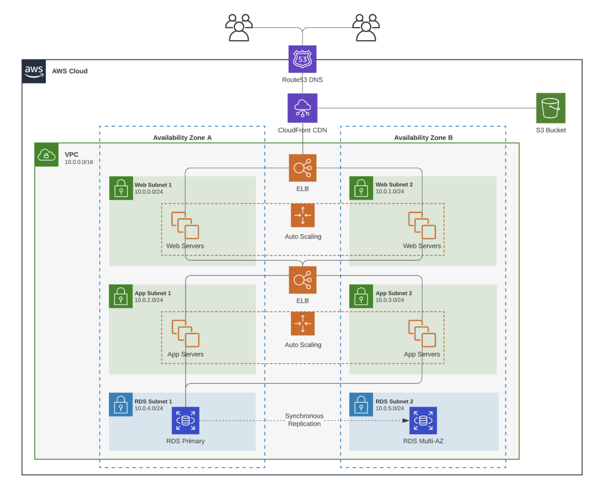

# Internship Project

## Project Overview
Typically, the bulk of your time during your internship will be spent
working on a project that will be integrated with the rest of the 
team's work. Depending on your manager, you may or may not 
be given the choice between several projects.

In the first few weeks of your internship, you should schedule 
a meeting with your manager and/or mentor to go through your
project specification and requirements. During this meeting,
you should take the following steps:

1. **Ask Clarifying Questions:** As an intern, you're not expected to
understand everything about the project immediately, so you should ask
questions regarding things you don't understand.
2. **Work Out an Appropriate Scope:** Set up milestones for where you
should be at by the midpoint and final presentation.
3. **Define Stretch Goals:** Stretch goals are features you would want to add
to support the project after hitting the core requirements. It's OK to not have
all of your stretch goals defined immeidately, but it's good to think about these
over the course of your internship.

Your intern project is one of the primary factors that will go into
your overall evaluation for a return offer, so it is *critical* that 
you align with your manager and mentor early on the expectations.  

Your project should be challenging enough that you are learning new technologies and solutions
for tackling problems, but not so challenging as though you are overwhelemed with
the project expectations.

Throughout the course of your internship, you should schedule progress checkins on
a weekly basis to troubleshoot sticky points and make updates to the 
timeline as needed.

## Design Document
Before you start with the implementation, you should create a design document
outlining the overall layout of your project. This typically will take the 
form of a design document, where you outine your problem statement and proposed
implementation.

Your design document should consist of the following sections:

1. **Problem Statement:** Motivation for why you are even
implementing this in the use case. What problem does the team currently
have, and how does this project help solve this problem?
2. **High-Level Design:** An overview as to 
how your solution will work and what it does. How does your solution address
the problem above, and what ideas does it incorporate.
3. **Technical Design:** The meat of your design document. Do a deep-dive
into each specific component and explain the end-to-end design of each
part (how are you fetching data, how do you render results, how does the user
interact, etc.). The specifics of what questions you should address will vary
depending on your specific project, but you want to give enough detail to
explain how your system interacts so that other teammates will be able to 
understand and build on top of your work after your internship. 
    - 
**Pro Tip:**

Use diagrams! They are a great way to show the end-to-end
    design and are more digestible than prose. We recommend using [Lucid Charts](https://www.lucidchart.com/pages)
    to make your diagrams
4. **Alternative Designs & Pros + Cons:** Often times, there is more than one solution to a problem, and
you should consider multiple approaches and their tradeoffs before narrowing down to one final design.
Briefly outline what altneratives you had and why they aren't as effective in your specific use cases.
5. **Appendices:** Include data sources, graphs, and other information that is needed that you did not 
include in the above sections.

  
  <figcaption>
  <i>
    <a href="https://www.lucidchart.com/pages/architecture-diagram/">Sample Lucid Chart Outlining System Architecture</a>
    </i>
  </figcaption>

You should aim to finish your design document draft before the halfway point of your internship. Once complete,
you should schedule a meeting with your entire team to present your document. Often times, this is where you 
will get new suggestions or concerns that you may not have considered earlier and will need to incorporate
in your final design, hence why we recommend getting your design document done early.

## Final Presentation
Alongside your overall project, you will also likely have to give a final presentation documenting
your work throughout your internship and outlining next steps. This is sort of a culmination of the
work that you've done, and you'll likely be presenting this to other stakeholders and other people
outside of your team.

While presentations can be scary, the good news is that your design document already contains 
most of the information that you need!

For your presentation, you should make sure to include the following sections:

1. **Introduction:** Give a brief background about yourself and your team.
2. **Problem + Motivation:** What problem are you trying to solve and why are you trying to solve it?
3. **High Level Design:** How does your solution address the problem?
4. **Use Cases + Extensions:** How can other people use your solution and build on top of it in the future?
5. **Learnings:** One of the core parts of an internship is learning new technologies and skills, so it's good
to have a section addressing your internship as a whole.
6. **Acknowledgements:** Don't forget to give credit to your manager, teammates, and any other coworkers you interacted with
over the course of your project.

The goal of your presentation is primarily to give a pitch about your project and *why* it is worthwhile
as opposed to a technical deep-dive. Most attendees will not be familiar with your exact team's tech stack and 
are more interested in the end-to-end process rather than the low-level system details.

One again, **START EARLY**. While you already have a lot of the content prepared, there is still a lot of work
to create and polish your presentation. We recommend getting this done at least 2 weeks before your presentation date
so that you have enough time to practice, make edits, and address questions that come up during your run-throughs.