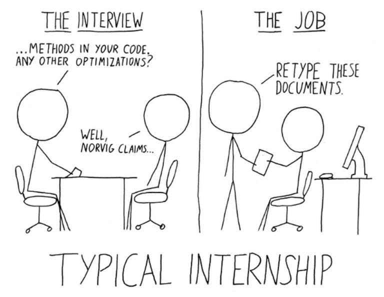

# A Guide to Navigating a Technical Internship

## Introduction
Welcome, and congrats on your internship offer! While there is a lot of material on the internet
about how to apply and interview for an internship, we understand that there is less material
regarding what to do once you've signed the offer. This guide is intended to offer some insights
into the process afterwards, from securing housing to your first day on the job and working on
your internship project.

With the current state of the market, doing well in an internship and securing a Return Offer is 
one of the primary ways that students get full-time jobs upon graduation, so this guide is intended
to help you put your best foot forward throughout your time at your company.

**DISCLAIMER:** This guide is intended for a large audience, and may thus not include specific
things required at your company. We do not guarantee that following this guide will give you a
Return Offer. All interns should consult with their managers for best practices and follow those
if they deviate from this guide.

  
  <figcaption>
    <a href="https://alexeymk.com/a-brief-guide-to-tech-internships/">Source</a>
  </figcaption>

