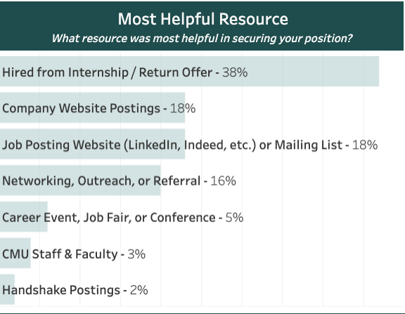
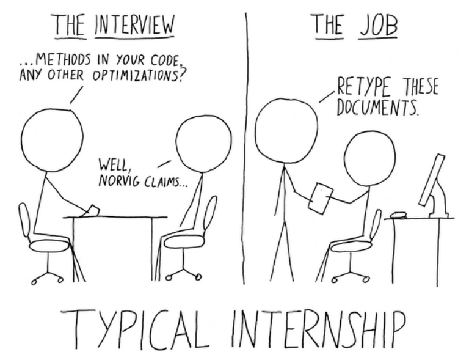

<h1> A Guide to Navigating a Technical Internship </h1>

## Introduction
Welcome, and congrats on your internship offer! While there is a lot of material on the internet
about how to apply and interview for an internship, we understand that there is less material
regarding what to do once you've signed the offer. This guide is intended to offer some insights
into the process afterwards, from securing housing to your first day on the job and working on
your internship project.

## Why This Guide?
For many students, a technical internship is the primary pathway to a full-time job. 
For example, 38% of the graduating class of 2025 from CMU's School of Computer Science received their 
full-time offer through a return offer from an internship.

  
  <figcaption>
    <i>
    <a href="https://www.cmu.edu/career/outcomes/post-grad-dashboard.html" style="font-size: 12px">Statistics from CMU'S Career and Professional Development Center</a>
    </i>
  </figcaption>

The process of securing a job has significantly changed over the past five years, as companies increasingly use internships as an 
extended audition to find new talent instead of hiring directly after graduation. 
With the current state of the job market, doing well in your internship and securing a return offer 
is one of the most reliable ways to land a full-time role upon graduation.

Despite the importance of internships, most available resources focus almost entirely on securing one. 
Once you sign that offer letter, you're largely left to figure the rest out on your own. 
This guide is our attempt to fill that gap, covering the full arc of a technical internship with practical advice drawn from our own experiences, divided
into the following sections:

  1. **Before You Start:** Information for navigating housing, commuting, and connecting with your manager
  2. **Onboarding:** How to get yourself oriented within the company
  3. **Navigating Office Relationships:** Advice for working with your co-workers
  4. **Technical Background:** Important skills for working in a company, such as Git
  5. **Networking Beyond Your Team:** How to take advantage of social opportunities
  6. **Internship Project:** Steps for completing and presenting your intern project

Along the way, we also have pro tips and important reminders from our past experiences. We hope that this guide will help to alleviate
any anxieties and help you put your best foot forward!

with practical advice 
from our experience.

**DISCLAIMER:** 

This guide is intended for a large audience, and may thus not include specific
things required at your company. We do not guarantee that following this guide will give you a
return offer. All interns should consult with their managers for best practices and follow those
if they deviate from this guide.

  
  <figcaption>
    <i>
    <a href="https://alexeymk.com/a-brief-guide-to-tech-internships/" style="font-size: 12px">The Differences Between the Internship and the Job</a>
    </i>
  </figcaption>

